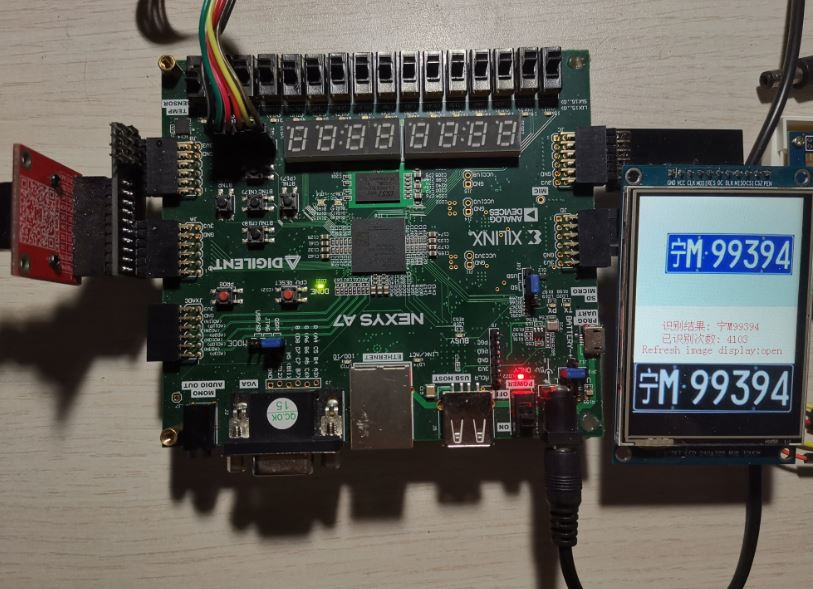
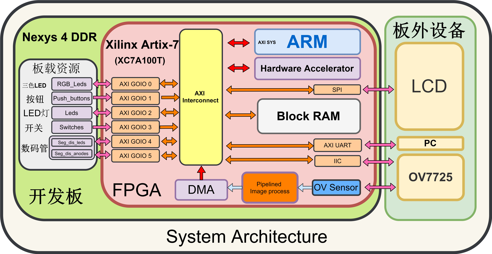
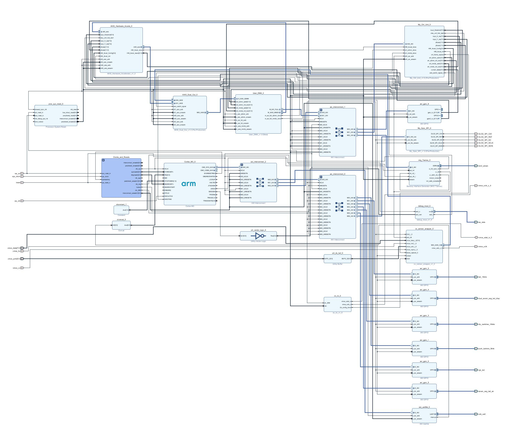
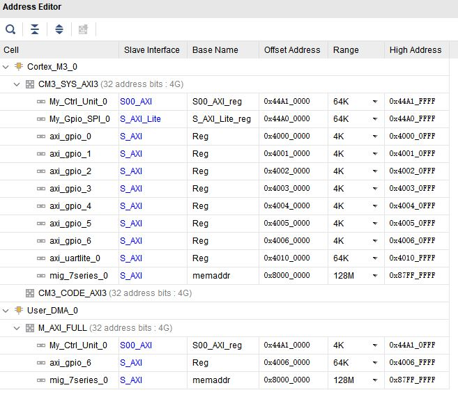
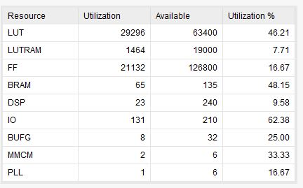
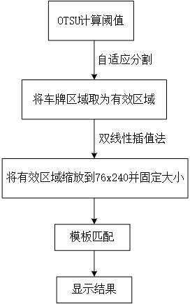
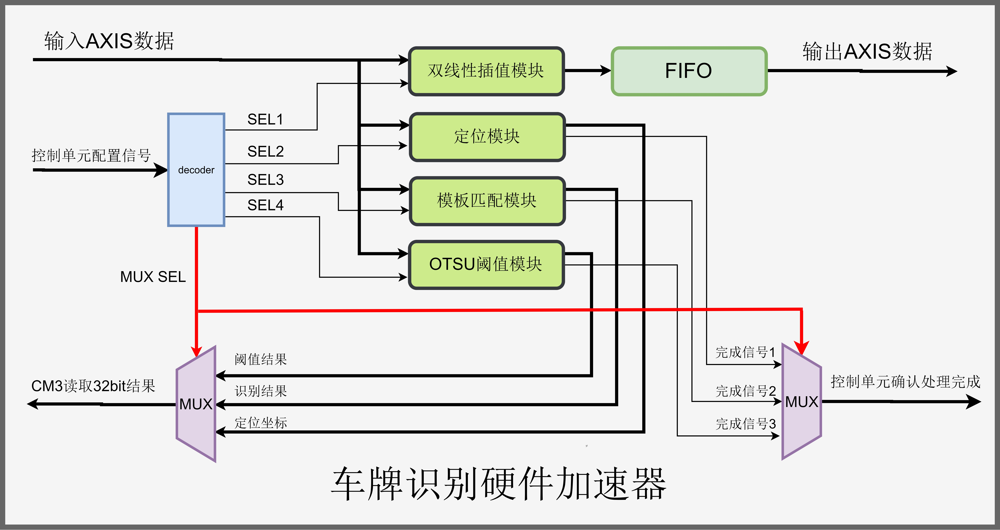
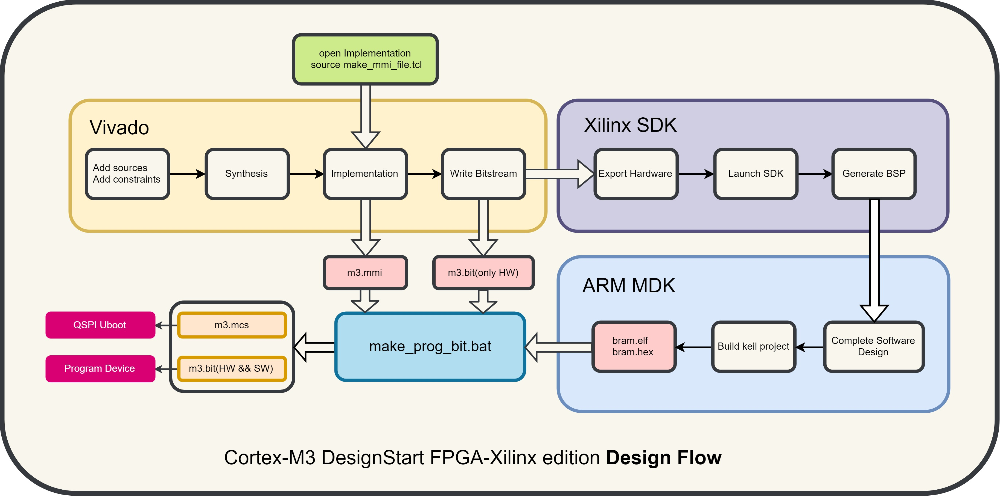

## 第一部分 设计概述

### 1.1 完成情况

本设计基于**Digilent Nexys A7-100T**开发板，采用**DesignStart FPGA -Xilinx Edition**软核搭建SOC系统,又构建了硬件加速器完成硬件加速实现快速车牌识别.

### 1.2 实物图

通过开启第一个开关启动刷新图像显示，上方彩色图像是摄像头捕获帧的160×240大小的一部分，下方灰度图像是将矩形框框取的车牌区域双线性插值缩放到76×240大小的区域。中间区域显示结果、已经识别的次数以及刷新图像显示的开闭状态.

## 第二部分 系统简述

第二部分将对整个系统技术细节加以概括，从系统的角度对设计的架构进行介绍。

### 2.1 硬件设计简述

#### 2.1.1 硬件系统架构

整个硬件系统架构设计如下。

#### 2.1.2 Vivado Block Design

​	下图是vivado的block design。

#### 2.1.3 内存映射

#### 2.1.4 时钟域

时钟划分为三类。

第一类：CM3，工作在Clocking Wizard 分频输出的50MHz。

第二类：SPI、AXI GPIO 0~5、SCCB模块，工作在Clocking Wizard 分频输出的25MHz。

第三类：MIG的AXI接口、图像缓存、硬件加速器、协处理控制单元、AXI GPIO6，工作在MIG输出的50MHz时钟。

#### 2.1.5 资源消耗

### 2.2 算法与硬件加速设计流程

由于比赛规则要求不高,所以算法很简单.本设计在算法设计中，通过OTSU（大津法，又名最大类间方差法）计算阈值，从而将未知位置的车牌前景区域与白色背景区域进行自适应分割，根据阈值将车牌区域用矩形框框取作为有效区域，再通过双线性插值将矩形区域缩放到76×240固定大小，通过模板匹配对应位置的可能的汉字、字母、数字匹配，对应最优值作为匹配结果。

识别过程如下图所示。

随后通过Verilog编写流式硬件加速器，内部结构如下图所示。

### 2.3 开发流程简述

通过更新mmi文件实现HEX文件与比特流文件合成。

